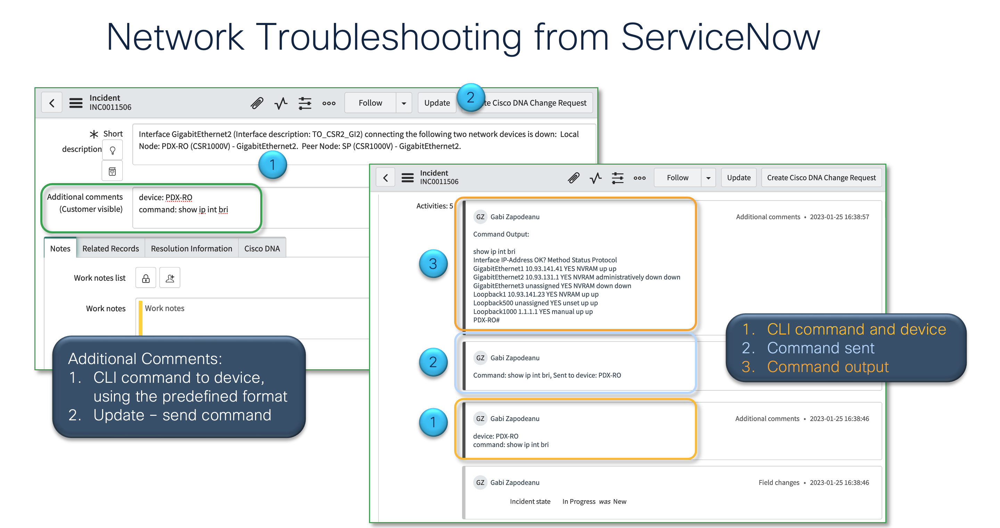

# Cisco DNA Custom Workflows 

Repo for Cisco DNA Center ITSM Integration (ServiceNow) Custom Workflows.

**"command_runner.js"**:

This application is included in the scoped app: "Cisco DNA Custom Workflows". This App is in development.
The script is triggered when a new "Additional Comment" is added to an incident.
The comment must be formatted in this way:
     device: deviceHostname
     command: CLI command

Example of a valid additional comment:
     device: PDX-M
     command: show ip int bri

The app will call the Cisco DNA Center REST APIs to:
 - obtain a Cisco DNA Center token
 - identify the device UUID for the device with the hostname
 - send the CLI command to device with the command runner APIs
 - retrieve the command output
 - post the command output in the incident notes

All application logs start with "DNA Custom Workflow --  "

Requirements:
- Cisco DNA Center
- ServiceNow instance
- Cisco DNA App installed and configured on ServiceNow
- ServiceNow MID server

[]
 
@author gabi@cisco.com, Gabriel Zapodeanu, TME, Cisco Systems

Thank you szapodeanu19@gmail.com, Stephan Zapodeanu, CS Student, Purdue University, for your contributions to this app development.

